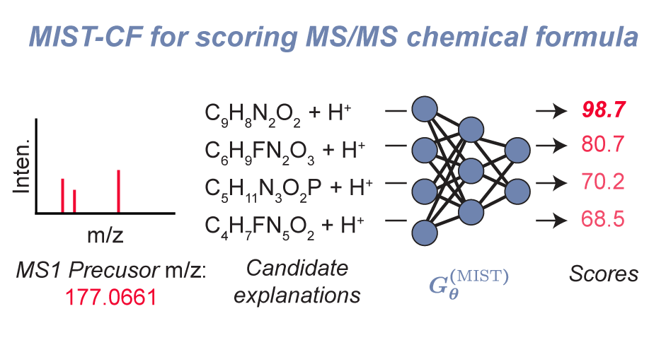

#  MIST-CF: Metabolite Inference with Spectrum Transformers (Chemical Formula)

[](https://zenodo.org/badge/latestdoi/666904485)


This repository provides implementations and code examples for
[MIST-CF](https://www.nature.com/articles/s42256-023-00708-3), an extension of
[MIST](https://www.nature.com/articles/s42256-023-00708-3) for annotating MS1
precursor masses from MS/MS data in a _de novo_ setting. MIST-CF ranks chemical
formula and adduct assignments for an unknown mass spectrum using an end-to-end
energy based modeling approach, without referencing any spectrum databases.
Instead of computing fragmentation trees, MIST-CF adopts a formula transformer
neural network architecture and learns in a data dependent fashion.


Paper: [https://pubs.acs.org/doi/full/10.1021/acs.jcim.3c01082](https://pubs.acs.org/doi/full/10.1021/acs.jcim.3c01082)  



We note several advances to the MIST-CF chemical formula transformer architecture over the original MIST chemical formula transformer that we plan to add back into the MIST model architecture used for fingerprint prediction in future work: 

1. Utilizing an internal chemical subformula assignment protocol (rather than SIRIUS fragmentation trees) 
2. Considering multiple adduct types beyond [M+H]+ (still only positive mode)
3. Utilizing sinusoidal *formula* embeddings as developed in our previous work [SCARF](https://arxiv.org/abs/2303.06470)
4. Embedding instrument type used to measure the MS/MS as an additional model "covariate" to help make predictions
5. Embedding the neutral loss fragment formula for each peak in addition to the fragment formula


##  Table  of  Contents

1.  [Install  &  setup](#setup)  
2.  [Quick  start](#quickstart)  
3.  [Data](#data)  
4.  [Training models](#models)  
5.  [Experiments](#experiments)  
6.  [Analysis](#analysis)  
7.  [Citations](#citations)  


##  Install  &  setup  <a name="setup"></a>

After git cloning the repository, the enviornment and package can be installed using [Mamba](https://mamba.readthedocs.io/en/latest/installation.html):
```

mamba env create -f environment.yml
mamba activate ms-gen
pip install -r requirements.txt
python setup.py develop

```


###  SIRIUS  <a name="sirius"></a>

To list out all potential formulae for an observed MS1 mass, we utilize the dynamic programming algorithm implemented by SIRIUS, `SIRIUS decomp`, which is provided as an independent module. SIRIUS can be downloaded and moved into a respective folder using the following commands. For non linux based systems, we suggest visiting the [SIRIUS  website](https://bio.informatik.uni-jena.de/software/sirius/).  

**Download sirius:**

```
device=linux64  
version=5.5.7   
url_base=https://github.com/boecker-lab/sirius/releases/download/  
wget ${url_base}v$version/sirius-$version-$device-headless.zip    
unzip sirius-$version-$device-headless.zip    
rm sirius-$version-$device-headless.zip

```

**Set SIRIUS environment variable:**

```
echo 'export SIRIUS_PATH=${your_sirius_path}' >> ~/.bashrc
. ~/.bashrc
```


##  Quick  start  <a name="quickstart"></a>

We have released a trained MIST-CF model (using the public NPLIB1/CANOPUS dataset). This can be downloaded (`quickstart/download\_model.sh`) and used to predict a set of 10 spectra from CASMI22, as included at `data/demo_specs.mgf` using the following commands:

 
```
# MIST-CF quickstart
. quickstart/download_model.sh
. quickstart/run_model.sh

```

Model output will be saved in `quickstart/mist_cf_out/`. This model may be less performant than the model trained on the commercial NIST20 Library (particularly for Orbitrap or higher resolution data). Download links to models trained on NIST20 models are available upon reasonable request to users with a NIST license. 

MIST-CF scores the agreement between a precursor formula candidate and an unknown spectrum. Refer to `notebooks/demo_mist_cf.ipynb` for an interactive demo of how to use MIST-CF and also set user-defined formula candidates.

##  Data  <a name="data"></a>

Four key datasets were used in the process of this paper: 
1. biomols: A dataset of biologically relevant molecules that we used to learn a fast filter model
2. NPLIB1: A public natural products dataset extracted from the GNPS database. NPLIB1 is used for model training and evaluation.
3. NPLIB1 + NIST: A proprietary dataset of NPLIB1 and NIST20 spectra. This dataset is used for model training and evaluation.
4. CASMI 2022: A dataset of positive mode spectra from the CASMI 2022 challenge. This dataset is used for prospective analysis.   

We provide instructions for downloading and extracting datasets biomols, NPLIB1, and CASMI 2022 as we preprocessed them.

For a more in depth view and understanding of our preprocessing pipeline, we refer the reader to `preprocessing/run_all.sh` and other relevant preprocessing scripts.  

### BIOMOL

Fast filter model is trained using a large database of molecules and chemical formula
extracted from varous sources prepared by [Dührkop et al.](https://pubmed.ncbi.nlm.nih.gov/33230292/).

```
# download data and extract it under ./data/biomols
wget  https://zenodo.org/record/8151490/files/biomols.zip

unzip biomols.zip
mv biomols data/
rm biomols.zip
```

### NPLIB1

NPLIB1 is a public natural products dataset extracted from the GNPS database. NPLIB1 is used for model training and evaluation. We refer to this in the directory structure as "canopus_train"

```
# download data and extract it under ./data/canopus
wget https://zenodo.org/record/8151490/files/canopus_train.zip

unzip canopus_train.zip
mv canopus_train data/
rm canopus_train.zip
```

### CASMI 2022

[CASMI-2022](http://www.casmi-contest.org/2022/index.shtml) dataset is a well-accepted and recent benchmark.

```
# download data and extract it under ./data/canopus
wget https://zenodo.org/record/8151490/files/casmi22.zip

unzip casmi22.zip
mv casmi22 data/
rm casmi22.zip
```

##  Training models <a name="models"></a>

Most of our data processing pipelines refer to a dataset `nist_canopus`, that includes both NIST and NPLIB1 jointly. The following instructions provide a simple demo of how to train a model on the NPLIB1 only (`canopus_train`) alone. 

Training a fast filter model: 

```
. run_scripts/public_data_train/train_fast_filter.sh
```

Training a mist cf model:

```
. run_scripts/public_data_train/train_mist_cf.sh
```


The exact source locations for each of the training and predict files is also listed for reference:

**FastFilter**   
1. *Train*: `src/mist_cf/fast_form_score/train.py`   
2. *Predict*: `src/mist_cf/fast_form_score/predict.py`

**MIST-CF**   
1. *Train*: `src/mist_cf/mist_cf_score/train.py`   
2. *Predict*: `src/mist_cf/mist_cf_score/predict.py`
2. *Prospective analysis*: `src/mist_cf/mist_cf_score/predict_mgf.py`

**FFN**
1. *Train*: `src/mist_cf/ffn_score/train.py`   
2. *Predict*: `src/mist_cf/ffn_score/predict.py`

**Xformer**   
1. *Train*: `src/mist_cf/xformer_score/train.py`   
2. *Predict*: `src/mist_cf/xformer_score/predict.py`

##  Experiments <a name="experiments"></a>

The entries below provide a record of our experiments used in our initial MIST-CF paper. While not intended to be re-run exactly as shown below due to the requirement of the `nist_canopus` subfolder and data, these demonstrate the parameters and call signatures we utilized.  

### Evaluate fast filter
Evaluate fast filter performance of reducing formula candidates.

Experiment pipeline: 
1. *Hyperopt fast filter model*: `run_scripts/hyperparams/find_fast_params.sh`  
2. *Edit fast filter config file*: `configs/fast_filter.yaml` 
3. *Train fast filter model*: `run_scripts/fast_filter/launch_fast_train.sh`   
4. *Evaluate fast filter prediction*: `run_scripts/fast_filter/launch_fast_pred.py`     

### Retrospective benchmarking
Benchmark MIST-CF performance with baseline models.

Experiment pipeline: 
1. *Hyperopt all models*
    - `run_scripts/hyperparams/find_mist_cf_params.sh`   
    - `run_scripts/hyperparams/find_ffn_params.sh`
    - `run_scripts/hyperparams/find_xformer_params.sh`
2. *Edit model config files*: 
    - `configs/mist_cf_canopus.yaml`   
    - `configs/ffn_canopus.yaml`  
    - `configs/ms1_canopus.yaml`  (hyperparameter same as ffn)
    - `configs/xformer_canopus.yaml`  
3. *Train models*: 
    - `run_scripts/benchmarking/train_mist_cf.sh`  
    - `run_scripts/benchmarking/train_ffn.sh`
    - `run_scripts/benchmarking/train_ms1.sh`
    - `run_scripts/benchmarking/train_xformer.sh`
4. *Evaluate models*: `run_scripts/benchmarking/eval_models.py`


### Sweep MS2 peak number
Show that few MS2 peaks are sufficient to learn candidate formula ranking.

Experiment pipeline: 
1. *Edit MS2 peak config file*: `configs/mist_cf_canopus_nist_max_subpeak.yaml`
2. *Train models*: `run_scripts/max_subpeak/train_mist_cf_subpeak.sh`
3. *Evaluate models*: `run_scripts/max_subpeak/eval_models.py`

### Comparison with SIRIUS on test data
Compare MIST-CF and SIRIUS using a single split of NPLIB1 test data.

Experiment pipeline: 
1. *Run SIRIUS prediction*: `run_scripts/sirius_compare/sirius_1_run.py`
2. *Format SIRIUS output*: `run_scripts/sirius_compare/sirius_2_wrangle.py`
3. *Run MIST-CF prediction*: `run_scripts/sirius_compare/mist_cf_1_predict.sh`
4. *Evaluate performance*: `run_scripts/sirius_compare/eval_models.py`

### Prospective analysis: CASMI 2022
Compare MIST-CF and SIRIUS on [CASMI-2022](http://www.casmi-contest.org/2022/index.shtml).

Experiment pipeline: 
1. *Run SIRIUS prediction*: `run_scripts/casmi22_eval/run_sirius.sh`
2. *Format SIRIUS output*: `run_scripts/casmi22_eval/wrangle_sirius.py`
3. *Run MIST-CF prediction*: `run_scripts/casmi22_eval/run_mist_cf.sh`
4. *Evaluate performance*: `run_scripts/casmi22_eval/eval_models.py`

## Analysis <a name="analysis"></a>

Analysis scripts can be found in `analysis/` for evaluating model predictions `analysis/evaluate_pred.py`.

Additional analyses used for figure generation were conducted in `notebooks/`.

##  Citations <a name="citations"></a>

If you use this repository, please consider citing both our work and the original SIRIUS papers, as we still rely on their deterministic tool for formula enumerations: 

```

@article{doi:10.1021/acs.jcim.3c01082,
        author = {Goldman, Samuel and Xin, Jiayi and Provenzano, Joules and Coley, Connor W.},
        title = {MIST-CF: Chemical Formula Inference from Tandem Mass Spectra},
        journal = {Journal of Chemical Information and Modeling},
        doi = {10.1021/acs.jcim.3c01082},
        URL = {https://doi.org/10.1021/acs.jcim.3c01082},
}

```

1. Böcker, Sebastian, et al. "SIRIUS: decomposing isotope patterns for metabolite identification." Bioinformatics 25.2 (2009): 218-224.
2. Dührkop, Kai, et al. "SIRIUS 4: a rapid tool for turning tandem mass spectra into metabolite structure information." Nature methods 16.4 (2019): 299-302.
